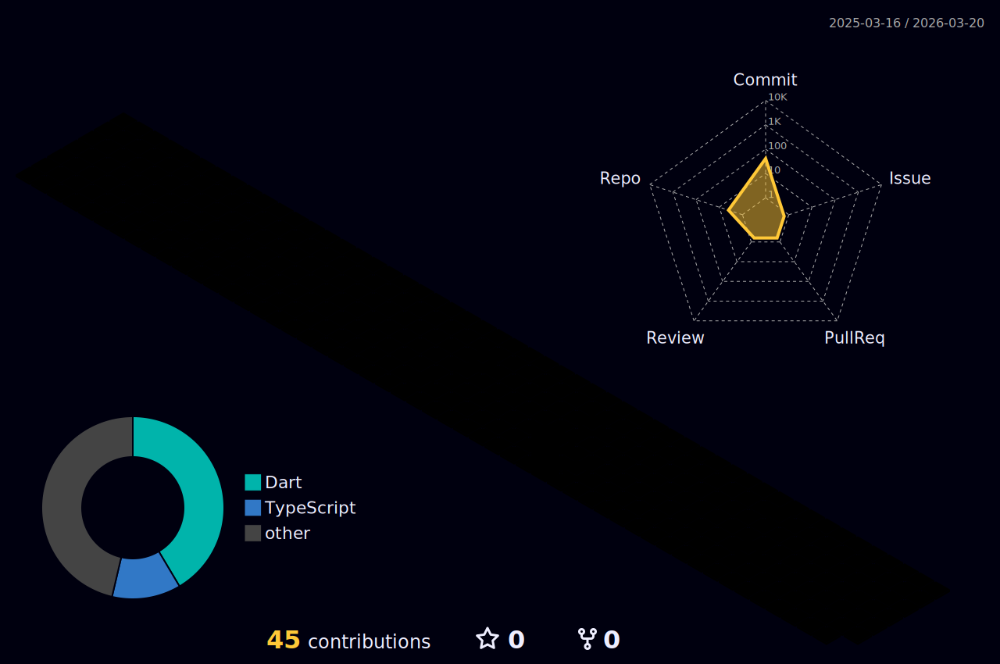

<h1 align="center">Mook_South Korea</h1>

<table width="100%">
<tr>
<td width="50%" valign="top">
<h3 align="center">💼 경력</h3>

<ul>
<li>
<strong>2024.03 ~ </strong> 
Chungang-University in Seoul 재학중 
Computer Science and Engineering
</li>
 
<li>
<strong>2025.09</strong> 
중원고등학교 멘토링 in 부천 
웹 프로그래밍의 기초와 AI툴을 활용한 서비스 제작
</li>
 
<li>
<strong>2025.08</strong> 
동작구 코딩 캠프 강사 
Python 및 AI 기초 강의
</li>
 
<li>
<strong>2023.12 ~ 2024.02</strong> 
파모즈 – XR 콘텐츠 제작 보조 
SDK 자료 조사 · 라이브러리 C++ 코드 분석 · 센서 테스트 보조
</li>
 
</ul>
</td>

<td width="50%" valign="top">
<h3 align="center">🌟 대외 활동</h3>

<ul>
<li>
<strong>2025.10.31 ~ 2025.10.31</strong> 
<a href='https://github.com/Tae4an/PES'> 2025 SUMTECH 해커톤</a> 
재난 문자/대피 안내 서비스 기획 · 프론트 개발 · PR
</li>
 
</ul>
</td>
</tr>
</table>

<!--

-->

 
